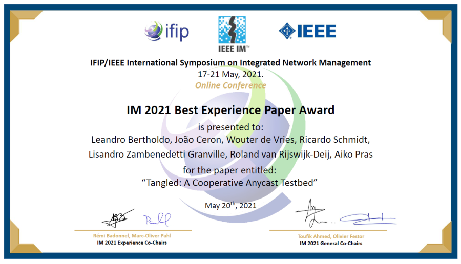

---

title:  Best Paper Awarded for TANGLED Testbed on IM2021 Experience Sessions

---

### TANGLED paper awarded on IM 2021 Experience Session [IFIP/IEEE International Symposium on Integrated Network Management](https://im2021.ieee-im.org/call-experience-session-papers)

The research paper “Tangled: A Cooperative Anycast Testbed” has received the Best Experience Paper Award at the
IM 2021 Experience Session [IFIP/IEEE International Symposium on Integrated Network Management]

The paper describes the “Tangled" anycast testbed that has been developed at DACS and uses a mix of crowd-sourced and cloud-based nodes to establish a global testbed for anycast experimentation. The paper was jointly written with researchers from SIDN Labs, the University of Passo Fundo and UFRGS (the latter both located in Brazil).

